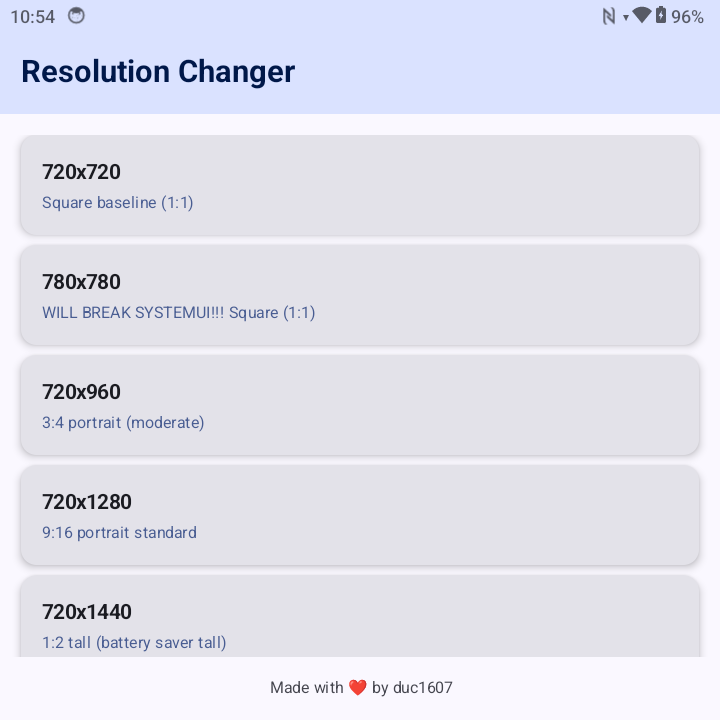

# Resolution Changer



A Kotlin/Compose Android app to quickly change the device display resolution. It attempts to use elevated privileges via **Shizuku** first (user-space binder), and falls back to traditional root (su) if Shizuku is unavailable or permission is denied. Resolution changes are applied using the `wm size` command.

## Features
- One-tap dynamic resolution switching through launcher shortcuts & presets
- Shizuku integration (no full root shell required when available)
- Root fallback execution path
- Preset index shortcuts and direct width/height intents
- Duplicate intent guard to avoid accidental double execution
- Compose UI with editable custom resolutions

## Requirements
| Capability | Purpose |
|------------|---------|
| Shizuku (recommended) | Run `wm size` without spawning a root shell |
| Root (fallback) | Alternative method if Shizuku not ready |
| WRITE_SECURE_SETTINGS / system uid (optional) | Present due to sharedUserId; not strictly needed for shell-based resolution change |

You need either a running Shizuku service (with granted permission) or a rooted device.

## Shizuku Setup
1. Install the Shizuku app from its official source.
2. Start Shizuku (ADB or root start depending on device).
3. Launch Resolution Changer – it will request Shizuku permission.
4. After granting, a snackbar will indicate Shizuku is active.

If Shizuku dies, the app will disable Shizuku usage until the binder returns.

## Root Fallback
If Shizuku cannot be used, the app executes:
```
su -c wm size <WIDTH>x<HEIGHT>
```
Make sure your root solution (Magisk/SU) grants permission.

## Shortcuts & Actions
The app defines static shortcuts (see `res/xml/shortcuts.xml`):
- Toggle resolution (cycles through presets)
- Set preset index 0/1/2 directly via deep links: `app://resolutionchanger/preset/<index>`

Custom intents supported by `ToggleShortcutActivity`:
- `android.intent.action.VIEW` with extras `width` and `height`
- `com.duc1607.resolutionchanger.action.SET_RESOLUTION` (extras: `width`, `height`)

## Build & Run
Standard Gradle Android project.
```cmd
./gradlew.bat assembleRelease
```
The APK will be in `app/release/`.

Install APK:
```cmd
adb install -r app\release\app-release.apk
```

Launch main UI:
```cmd
adb shell am start -n com.duc1607.resolutionchanger/.MainActivity
```

## Troubleshooting
| Symptom | Cause | Fix |
|---------|-------|-----|
| Snackbar says Shizuku unavailable | Binder not running or permission denied | Start Shizuku, grant permission in dialog |
| Resolution not changing | Command blocked by SELinux or no root/Shizuku | Verify root or Shizuku status; check logcat tag `ResolutionChanger` |
| Activity logs two VIEW intents | First was parcelled and ignored; second processed | Working as designed |
| Shizuku reflection fails | Upstream API change or hidden method | Use official Shizuku shell APIs (future improvement) |

## Logging
Filter by tags:
- `ResolutionChanger`
- `ToggleShortcutActivity`

## Security Notes
Using shared system UID or protected permissions may require system app installation or modified environment. The actual resolution change here is shell-based; ensure you trust the source and review manifest permissions.

## Future Improvements
- Replace reflection on `newProcess` with official Shizuku API wrapper
- Dynamic preset management persistence
- Direct binder `IWindowManager` calls for resolution (if permissible)
- Adaptive duplicate interval based on user interaction speed

## Disclaimer
Changing display size can affect UI scaling and app layouts. Test gradually.

---
Feel free to open issues or submit PRs.

